## 简介

1. 区域截图
2. 矫正倾斜图片
3. 调用OCR识别并输出结果

详见[用python改善OCR识别结果](http://www.xuchengjing.cn/用python改善OCR识别结果/)

## 识别效果

|      |           截图            |       天若OCR识别结果        | 我们的识别结果              |
| :--: | :-----------------------: | :--------------------------: | --------------------------- |
|  01  |  | 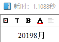 | 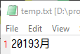 |
|  02  |  | 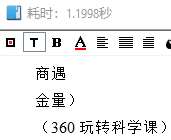 | 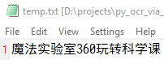 |
|  03  |  | 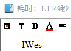 | 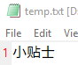 |
|  04  | 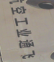 | 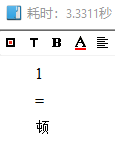 | 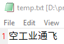 |
|  05  |  | 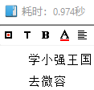 | 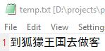 |
|  06  |  | 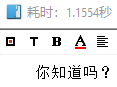 | 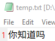 |
|  07  |  | 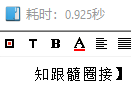 | 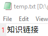 |
|  08  | 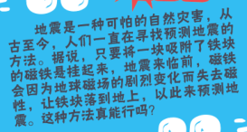 | 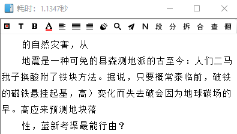 | 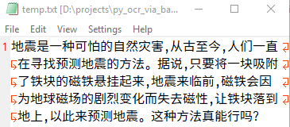 |
|  09  | 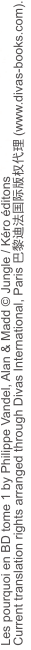 | 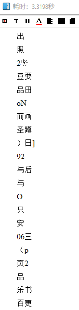 | 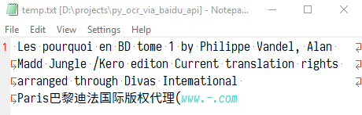 |
|  10  | 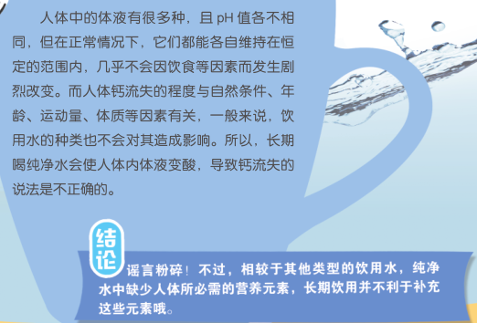 | 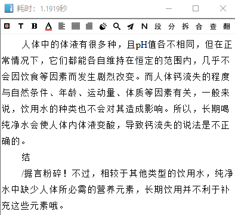 |  |
|  11  |  | 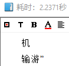 | 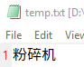 |
|  12  |  | 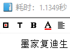 | 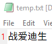 |

